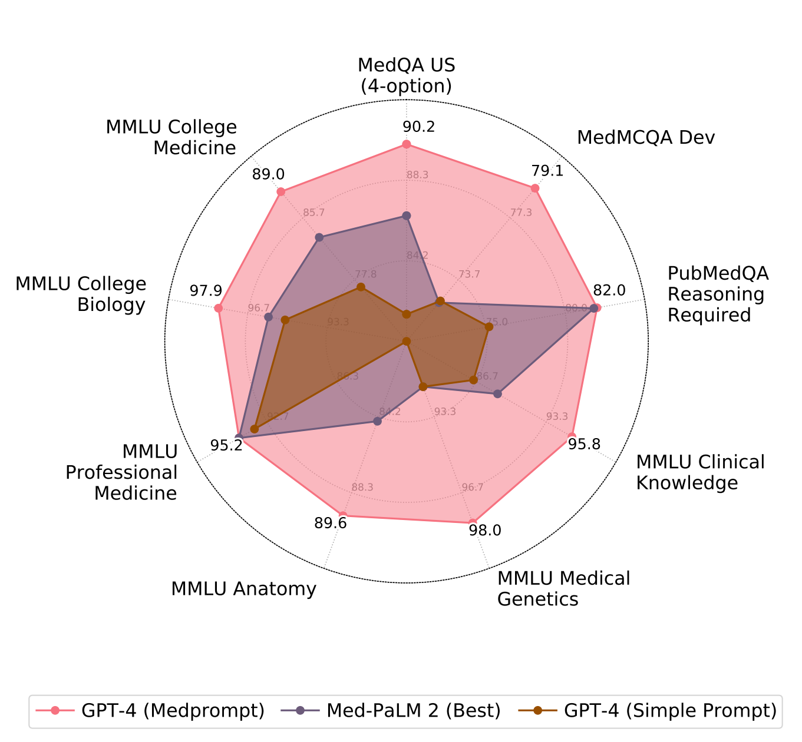
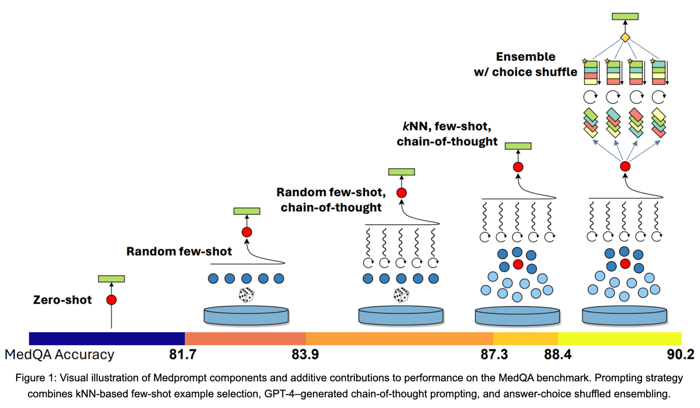
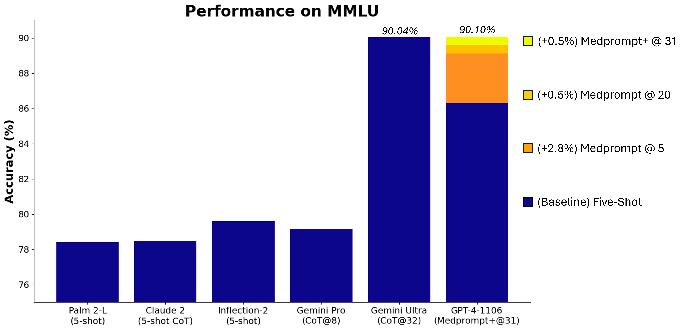

# promptbase

> Note: Some scripts hosted here are published for reference on methodology, but may not be immediately executable against public APIs. We're working hard on making the pipelines easier to run "out of the box" over the next few days, and appreciate your patience in the interim!

`promptbase` is an evolving collection of resources, best practices, and example scripts for eliciting the best performance from foundation models like `GPT-4`. We currently host scripts demonstrating the [`Medprompt` methodology](https://arxiv.org/abs/2311.16452), including examples of how we further extended this collection of prompting techniques ("`Medprompt+`") into non-medical domains: 

| Benchmark | GPT-4 Prompt | GPT-4 Results | Gemini Ultra Results |
| ---- | ------- | ------- | ---- |
| MMLU | Medprompt+ | 90.10% | 90.04% |
| GSM8K | Zero-shot | 95.3% | 94.4% |
| MATH | Zero-shot | 68.4% | 53.2% |
| HumanEval | Zero-shot | 87.8% | 74.4% |
| BIG-Bench-Hard | Few-shot + CoT | 89.0% | 83.6% |
| DROP | Zero-shot + CoT | 83.7% | 82.4% |
| HellaSwag | 10-shot | 95.3% | 87.8% |


In the near future, `promptbase` will also offer further case studies and structured interviews around the scientific process we take behind prompt engineering. We'll also offer specialized deep dives into specialized tooling that accentuates the prompt engineering process. Stay tuned!

## `Medprompt` and The Power of Prompting

<details>
<summary>
    <em>"Can Generalist Foundation Models Outcompete Special-Purpose Tuning? Case Study in Medicine" (H. Nori, Y. T. Lee, S. Zhang, D. Carignan, R. Edgar, N. Fusi, N. King, J. Larson, Y. Li, W. Liu, R. Luo, S. M. McKinney, R. O. Ness, H. Poon, T. Qin, N. Usuyama, C. White, E. Horvitz 2023)</em>
</summary>
<br/>
<pre>

@article{nori2023can,
  title={Can Generalist Foundation Models Outcompete Special-Purpose Tuning? Case Study in Medicine},
  author={Nori, Harsha and Lee, Yin Tat and Zhang, Sheng and Carignan, Dean and Edgar, Richard and Fusi, Nicolo and King, Nicholas and Larson, Jonathan and Li, Yuanzhi and Liu, Weishung and others},
  journal={arXiv preprint arXiv:2311.16452},
  year={2023}
}
    </pre>
    <a href="https://arxiv.org/pdf/1909.09223.pdf">Paper link</a>
</details>



In this study, we show how the composition of several prompting strategies into a method that we refer to as `Medprompt` can efficiently steer generalist models like GPT-4 to achieve top performance, even when compared to models specifically finetuned for medicine. `Medprompt` composes three distinct strategies together -- including dynamic few-shot selection, self-generated chain of thought, and choice-shuffle ensembling -- to elicit specialist level performance from GPT-4.




## `Medprompt+` | Extending the power of prompting 

Here we provide some intuitive details on how we extended the `medprompt` prompting framework to elicit even stronger out-of-domain performance on the MMLU (Measuring Massive Multitask Language Understanding) benchmark.  MMLU was established as a test of general knowledge and reasoning powers of large language models.  The complete MMLU benchmark contains tens of thousands of challenge problems of different forms across 57 areas from basic mathematics to United States history, law, computer science, engineering, medicine, and more. 



We found that applying Medprompt without modification to the whole MMLU achieved a score of 89.1%. Not bad for a single policy working across a great diversity of problems!  But could we push Medprompt to do better?  Simply scaling-up MedPrompt can yield further benefits. As a first step, we increased the number of ensembled calls from five to 20.  This boosted performance to 89.56%. 

On working to push further with refinement of Medprompt, we noticed that performance was relatively poor for specific topics of the MMLU. MMLU contains a great diversity of types of questions, depending on the discipline and specific benchmark at hand. How might we push GPT-4 to perform even better on MMLU given the diversity of problems? 

## Running Scripts

First, clone the repo and install the promptbase package:

```bash
cd src
pip install -e .
```

Next, decide which tests you'd like to run. You can choose from:

- bigbench
- drop
- gsm8k
- humaneval
- math
- mmlu

Before running the tests, you will need to download the datasets from the original sources and place them in the `src/promptbase/datasets` directory.

After downloading datasets and installing the promptbase package, you can run a test with:

`python -m promptbase dataset_name`

For example:

`python -m promptbase gsm8k`

## Dataset Links

To run evaluations, download these datasets and add them to /src/promptbase/datasets/

 - MMLU: https://github.com/hendrycks/test
 - HumanEval: https://huggingface.co/datasets/openai_humaneval
 - DROP: https://allenai.org/data/drop
 - GSM8K: https://github.com/openai/grade-school-math
 - MATH: https://huggingface.co/datasets/hendrycks/competition_math
 - Big-Bench-Hard: https://github.com/suzgunmirac/BIG-Bench-Hard

## Other Resources:

Medprompt Blog: https://www.microsoft.com/en-us/research/blog/the-power-of-prompting/

Medprompt Research Paper: https://arxiv.org/abs/2311.16452

Microsoft Introduction to Prompt Engineering: https://learn.microsoft.com/en-us/azure/ai-services/openai/concepts/prompt-engineering

Microsoft Advanced Prompt Engineering Guide: https://learn.microsoft.com/en-us/azure/ai-services/openai/concepts/advanced-prompt-engineering?pivots=programming-language-chat-completions


